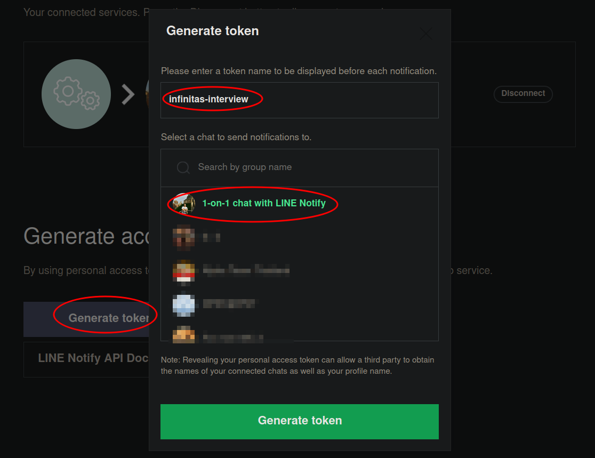
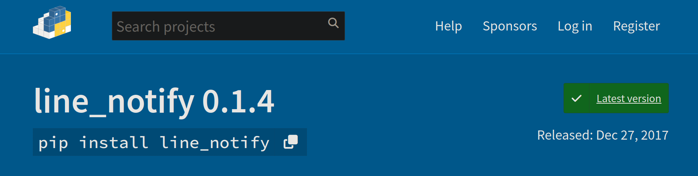
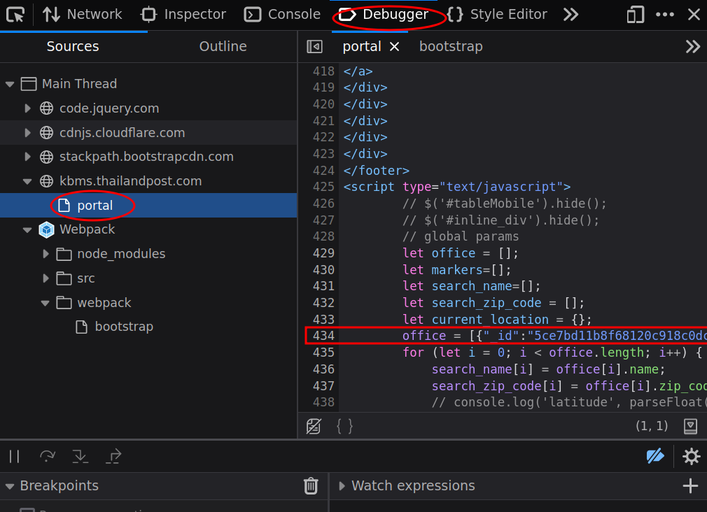
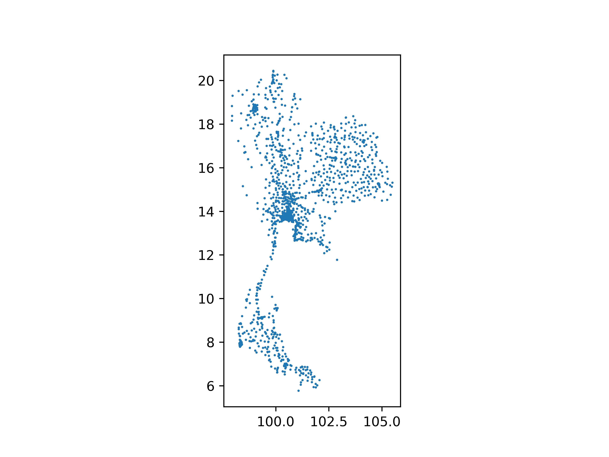

# Overview

This repository contains the assignment (for Gun Pinyo)
as an interview preparation for Infinitas (by Krungthai).

Note: to ensure the reproducibility, we will encapsulates
the whole assignment using Docker (see `.Dockerfile` and `docker-compose.yaml`).

Note: to ensure the confidentiality, we will put all secret in `secret.yaml`,
which only exists locally. I will attach this secret file in the submission
email.

# Task 1: LINE Notify

The solution is in [`src/task_1.py`](src/task_1.py).

Since the provided access-token can't be used for testing purpose, so I create
my own access-token especially for testing.

Both tokens are stored in `secret.yaml`. In this case, we can treat the provided
token as the token for production environment whereas my own token is for
development. Therefore, I have a variable `line-access-token-key` in
`config.yaml` to quickly change the environment.

Lastly, I notice that pip package `line_notify` was released on 27 Dec 2017 (5
years ago) so this package might be outdate. Nevertheless, I stick with this
package because it is the most popular among alternative package. In real case
scenario, I suggest that we directly manage the restful API which is publicized
in <https://notify-bot.line.me/doc/en/>.

# Task 2: Web Scraping

I chose to scrape on
[ThailandPost](https://kbms.thailandpost.com/portal). Actually, I did try to
scrape on [Kerry](https://th.kerryexpress.com/en/where-we-are/) as well but I
couldn't find a way to extract data.

When I inspect <https://kbms.thailandpost.com/portal>, I notices that there is a
JavaScript snippet (variable `office` at line 434).

Therefore, extract that data by:
- first, dump the entire page using a pip package `requests`;
- then, extract the `<script>` tag using a pip package `beautifulsoup4`;
- then, parse the data as python object using libraries `re` and `json`;
- finally, convert into a data frame using libraries `pandas`.

The code for this is in a function `scrape_thaipost` in
[`src/task_2.py`](src/task_2.py)

Next, we visualize this data. After some research, I believe that the easiest
way to visualize this is to use a python library
[GeoPandas](https://geopandas.org/en/stable/).

The code for this in a function `plot_geopanda_thaipost` in
[`src/task_2.py`](src/task_2.py). Remark: I am still not familiar with
`geopandas`; fortunately, there is a good [blogpost](https://medium.com/
super-ai-engineer/วิเคราะห์ข้อมูล-spatial-data-โดยใช้-geopandas-part1-90be80866ea2)
that I use as the main reference.

Remark: the figure above omits some location that has an invalid coordination

Finally, we produce a table that reports how many postal locations in each
province.

In the first attempt, I would like to search the column `location_office` (which
contains addresses in human language) and then look for a keyword containing
province names. Unfortunately, this column is too inconsistent: some address
doesn't contain any province name at all whereas some address contains multiple
province names. This sanity check is in a function
`sanity_check_address_consistency` in [`src/task_2.py`](src/task_2.py), which
you can see the actual result in
[`build/addr_inconsistency.log`](build/addr_inconsistency.log).

Alternatively, we can use the column `zip_code` (which contains postal codes).
However, we need to know the province name for each postal code; fortunately,
there is public data available
[here](https://download.geonames.org/export/zip/TH.zip), which I download and
store as a CSV file [here](assets/TH.csv); with this, we can
create a python dict that map each postal code to province name.

This table is generated from a function
`generate_province_name_to_num_locations` in [`src/task_2.py`](src/task_2.py),
which you can see the actual result in
[`province-name-to-num-locations.csv`](province-name-to-num-locations.csv).

# Task 3: SQL Dichana
I couldn't finish this task in time but you can see my working progress in:
- [`.Dockerfile`](.Dockerfile)
- [`docker-compose.yaml`](docker-compose.yaml)
- [`src/task_3.py`](src/task_3.py)
